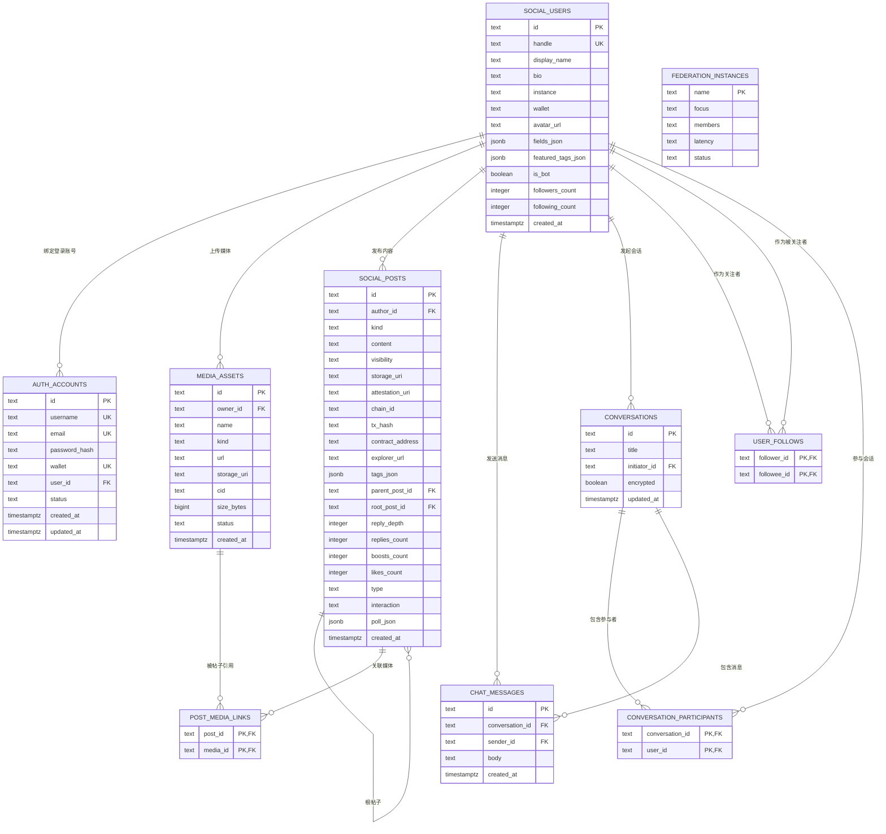

# MoleSociety 数据库 E-R 关系说明

本文档根据项目后端 PostgreSQL 迁移文件 `backend/migrations/0001_initial_schema.sql` 整理，描述 MoleSociety 系统当前数据库中的实体、字段和实体关系。

## 一、数据库实体概览

当前系统主要包含以下业务实体：

| 实体表 | 含义 |
| --- | --- |
| `social_users` | 社交平台用户信息表 |
| `auth_accounts` | 登录账号与认证信息表 |
| `social_posts` | 社交动态、回复、投票等内容表 |
| `media_assets` | 媒体资源表 |
| `post_media_links` | 帖子与媒体资源关联表 |
| `user_follows` | 用户关注关系表 |
| `conversations` | 私信会话表 |
| `conversation_participants` | 会话参与者关联表 |
| `chat_messages` | 私信消息表 |
| `federation_instances` | 联邦实例信息表 |
| `schema_migrations` | 数据库迁移记录表 |

其中，`schema_migrations` 属于技术维护表，用于记录数据库迁移版本，不属于核心业务实体。

## 二、E-R 图

## 三、实体说明

### 1. 用户实体 `social_users`

`social_users` 表用于保存平台用户的基础社交资料，是系统中的核心用户实体。该表包含用户编号、用户名、显示名称、个人简介、所属实例、钱包地址、头像地址、关注数量、粉丝数量等字段。

主要字段：

| 字段 | 含义 |
| --- | --- |
| `id` | 用户主键 |
| `handle` | 用户唯一标识名 |
| `display_name` | 用户显示名称 |
| `bio` | 用户简介 |
| `instance` | 用户所属实例 |
| `wallet` | 用户钱包地址 |
| `avatar_url` | 用户头像地址 |
| `followers_count` | 粉丝数量 |
| `following_count` | 关注数量 |
| `created_at` | 创建时间 |

### 2. 账号认证实体 `auth_accounts`

`auth_accounts` 表用于保存用户登录账号、邮箱、密码哈希、钱包绑定信息和账号状态。该表通过 `user_id` 与 `social_users` 表关联。

关系说明：

- 一个 `social_users` 用户可以关联多个 `auth_accounts` 记录。
- 从当前业务实现上看，注册流程通常为一个用户创建一个账号，但数据库层面没有对 `user_id` 设置唯一约束，因此 E-R 图中按一对多关系描述。

主要字段：

| 字段 | 含义 |
| --- | --- |
| `id` | 账号主键 |
| `username` | 登录用户名，唯一 |
| `email` | 邮箱，唯一 |
| `password_hash` | 密码哈希 |
| `wallet` | 绑定钱包地址，唯一 |
| `user_id` | 关联用户 ID |
| `status` | 账号状态 |

### 3. 社交内容实体 `social_posts`

`social_posts` 表用于保存用户发布的动态、回复、投票等社交内容。该表通过 `author_id` 关联发布者，并通过 `parent_post_id` 和 `root_post_id` 实现帖子回复关系。

关系说明：

- 一个用户可以发布多条帖子。
- 一条帖子可以拥有多条子回复。
- `parent_post_id` 表示当前帖子直接回复的父帖子。
- `root_post_id` 表示当前回复所属的根帖子。
- 一条帖子可以关联多个媒体资源。

主要字段：

| 字段 | 含义 |
| --- | --- |
| `id` | 帖子主键 |
| `author_id` | 作者用户 ID |
| `kind` | 内容类型 |
| `content` | 文本内容 |
| `visibility` | 可见性 |
| `storage_uri` | 内容存储地址 |
| `attestation_uri` | 证明或声明地址 |
| `chain_id` | 链 ID |
| `tx_hash` | 链上交易哈希 |
| `contract_address` | 合约地址 |
| `explorer_url` | 区块浏览器地址 |
| `tags_json` | 标签 JSON |
| `parent_post_id` | 父帖子 ID |
| `root_post_id` | 根帖子 ID |
| `poll_json` | 投票数据 JSON |
| `created_at` | 发布时间 |

### 4. 媒体资源实体 `media_assets`

`media_assets` 表用于保存图片、视频等媒体资源信息。媒体资源通过 `owner_id` 关联上传者，并通过 `post_media_links` 与帖子建立多对多关系。

关系说明：

- 一个用户可以上传多个媒体资源。
- 一个帖子可以关联多个媒体资源。
- 一个媒体资源也可以被多个帖子引用。

主要字段：

| 字段 | 含义 |
| --- | --- |
| `id` | 媒体资源主键 |
| `owner_id` | 上传者用户 ID |
| `name` | 文件名称 |
| `kind` | 媒体类型 |
| `url` | 访问地址 |
| `storage_uri` | 存储地址 |
| `cid` | 内容标识符 |
| `size_bytes` | 文件大小 |
| `status` | 资源状态 |
| `created_at` | 上传时间 |

### 5. 帖子媒体关联实体 `post_media_links`

`post_media_links` 是帖子与媒体资源之间的关联表，用于实现 `social_posts` 与 `media_assets` 的多对多关系。

字段说明：

| 字段 | 含义 |
| --- | --- |
| `post_id` | 帖子 ID |
| `media_id` | 媒体资源 ID |

该表以 `(post_id, media_id)` 作为联合主键，避免同一帖子重复关联同一媒体资源。

### 6. 用户关注关系实体 `user_follows`

`user_follows` 表用于保存用户之间的关注关系，是 `social_users` 表的自关联关系。

关系说明：

- `follower_id` 表示发起关注的用户。
- `followee_id` 表示被关注的用户。
- 一个用户可以关注多个用户，也可以被多个用户关注。
- 表中设置了 `CHECK (follower_id <> followee_id)`，避免用户关注自己。

字段说明：

| 字段 | 含义 |
| --- | --- |
| `follower_id` | 关注者用户 ID |
| `followee_id` | 被关注者用户 ID |

### 7. 会话实体 `conversations`

`conversations` 表用于保存私信会话信息。一个会话可以由某个用户发起，也可以包含多个参与者。

关系说明：

- 一个用户可以发起多个会话。
- 一个会话可以包含多个参与者。
- 一个会话可以包含多条聊天消息。

主要字段：

| 字段 | 含义 |
| --- | --- |
| `id` | 会话主键 |
| `title` | 会话标题 |
| `initiator_id` | 发起者用户 ID |
| `encrypted` | 是否加密 |
| `updated_at` | 更新时间 |

### 8. 会话参与者实体 `conversation_participants`

`conversation_participants` 是会话与用户之间的关联表，用于实现 `conversations` 与 `social_users` 的多对多关系。

字段说明：

| 字段 | 含义 |
| --- | --- |
| `conversation_id` | 会话 ID |
| `user_id` | 参与者用户 ID |

该表以 `(conversation_id, user_id)` 作为联合主键，保证同一个用户不会重复加入同一个会话。

### 9. 聊天消息实体 `chat_messages`

`chat_messages` 表用于保存私信会话中的具体消息内容。该表通过 `conversation_id` 关联所属会话，通过 `sender_id` 关联发送者用户。

关系说明：

- 一个会话可以包含多条聊天消息。
- 一个用户可以发送多条聊天消息。

主要字段：

| 字段 | 含义 |
| --- | --- |
| `id` | 消息主键 |
| `conversation_id` | 所属会话 ID |
| `sender_id` | 发送者用户 ID |
| `body` | 消息内容 |
| `created_at` | 发送时间 |

### 10. 联邦实例实体 `federation_instances`

`federation_instances` 表用于保存联邦实例信息，包括实例名称、关注方向、成员数量、延迟和运行状态等。

主要字段：

| 字段 | 含义 |
| --- | --- |
| `name` | 实例名称，主键 |
| `focus` | 实例关注方向 |
| `members` | 成员数量描述 |
| `latency` | 延迟信息 |
| `status` | 实例状态 |

说明：`social_users.instance` 字段在业务含义上表示用户所属实例，但当前数据库结构没有对 `federation_instances.name` 设置外键约束，因此二者属于逻辑关联，不属于数据库强约束关系。

## 四、关系汇总

| 关系 | 类型 | 数据库实现 |
| --- | --- | --- |
| 用户 - 账号 | 一对多 | `auth_accounts.user_id -> social_users.id` |
| 用户 - 帖子 | 一对多 | `social_posts.author_id -> social_users.id` |
| 用户 - 媒体资源 | 一对多 | `media_assets.owner_id -> social_users.id` |
| 帖子 - 媒体资源 | 多对多 | `post_media_links(post_id, media_id)` |
| 用户 - 用户关注 | 多对多自关联 | `user_follows(follower_id, followee_id)` |
| 帖子 - 回复 | 一对多自关联 | `social_posts.parent_post_id -> social_posts.id` |
| 帖子 - 根帖 | 一对多自关联 | `social_posts.root_post_id -> social_posts.id` |
| 用户 - 发起会话 | 一对多 | `conversations.initiator_id -> social_users.id` |
| 用户 - 参与会话 | 多对多 | `conversation_participants(conversation_id, user_id)` |
| 会话 - 消息 | 一对多 | `chat_messages.conversation_id -> conversations.id` |
| 用户 - 消息 | 一对多 | `chat_messages.sender_id -> social_users.id` |
| 用户 - 联邦实例 | 逻辑多对一 | `social_users.instance` 对应 `federation_instances.name`，无外键 |

## 五、论文描述建议

可以在论文中这样描述本系统的 E-R 关系：

本系统数据库采用 PostgreSQL 进行设计，围绕用户、账号认证、社交内容、媒体资源、关注关系、私信会话和联邦实例等核心对象建立数据模型。其中，`social_users` 表作为系统用户实体，是整个数据模型的核心；`auth_accounts` 表用于保存用户登录认证信息，并通过 `user_id` 与用户表建立关联；`social_posts` 表用于保存用户发布的社交内容，并通过 `author_id` 与用户表关联，同时通过 `parent_post_id` 和 `root_post_id` 实现帖子回复结构。

在媒体资源管理方面，系统使用 `media_assets` 表保存图片、视频等资源信息，并通过 `post_media_links` 关联表实现帖子与媒体资源之间的多对多关系。在用户社交关系方面，系统通过 `user_follows` 表实现用户之间的关注关系，该表以关注者和被关注者两个字段共同构成联合主键，从而保证关注关系的唯一性。

在私信功能方面，系统使用 `conversations` 表保存会话信息，使用 `conversation_participants` 表维护会话与用户之间的多对多参与关系，并使用 `chat_messages` 表保存具体消息内容。每条消息都关联到一个会话和一个发送用户，从而完整描述私信会话中的消息流转过程。

此外，系统使用 `federation_instances` 表保存联邦实例信息，用户表中的 `instance` 字段在业务上表示用户所属实例。由于当前数据库未对该字段设置外键约束，因此该关系属于逻辑关联。通过上述实体与关系设计，系统能够支持去中心化社交平台中的用户管理、内容发布、媒体展示、关注互动和私信通信等核心业务需求。
