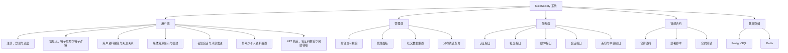

# MoleSociety 系统功能结构图

本文档根据当前项目中可以确认的前端路由、页面文件、后端接口、数据库表和智能合约目录整理。未在当前代码中形成明确页面或接口支撑的功能，不作为系统已实现功能描述。

## 一、整理依据

| 类型 | 项目位置 |
| --- | --- |
| 前端路由 | `frontend/src/router/index.ts` |
| 前端页面 | `frontend/src/pages` |
| 前端接口封装 | `frontend/src/api/authApi.ts`、`frontend/src/api/socialApi.ts` |
| 后端接口 | `backend/src/main/java/com/molesociety/backend/MoleSocietyApplication.java` |
| 数据库结构 | `backend/migrations/0001_initial_schema.sql` |
| 智能合约工程 | `monad-nft` |

## 二、系统功能结构图

```mermaid
flowchart TB
    A["MoleSociety 系统"]

    A --> B["用户端功能"]
    A --> C["管理端功能"]
    A --> D["服务端接口功能"]
    A --> E["智能合约模块"]
    A --> F["数据存储模块"]

    B --> B1["账号认证"]
    B1 --> B11["用户注册"]
    B1 --> B12["密码登录"]
    B1 --> B13["钱包签名登录"]
    B1 --> B14["当前登录用户查询"]
    B1 --> B15["退出登录"]

    B --> B2["主应用页面"]
    B2 --> B21["社交信息流展示"]
    B2 --> B22["帖子发布"]
    B2 --> B23["帖子详情查看"]
    B2 --> B24["帖子回复列表"]
    B2 --> B25["投票提交"]
    B2 --> B26["本地点赞、转发、收藏状态"]

    B --> B3["用户资料"]
    B3 --> B31["用户资料查看"]
    B3 --> B32["个人资料编辑"]
    B3 --> B33["关注用户"]
    B3 --> B34["取消关注"]

    B --> B4["媒体资源"]
    B4 --> B41["媒体资源查询"]
    B4 --> B42["媒体资源创建"]
    B4 --> B43["帖子关联媒体展示"]

    B --> B5["私信会话"]
    B5 --> B51["会话列表查询"]
    B5 --> B52["创建会话"]
    B5 --> B53["会话详情查询"]
    B5 --> B54["发送会话消息"]

    B --> B6["设置页面"]
    B6 --> B61["外观设置"]
    B6 --> B62["个人资料设置"]
    B6 --> B63["通知设置占位页"]
    B6 --> B64["隐私与安全占位页"]

    B --> B7["链上相关页面"]
    B7 --> B71["简单 NFT 铸造页面"]
    B7 --> B72["铸造确认页面"]
    B7 --> B73["奖励领取页面"]
    B7 --> B74["验证码校验页面"]
    B7 --> B75["铸造成功页面"]

    C --> C1["后台访问校验"]
    C --> C2["管理面板页面"]
    C --> C3["社交数据重置接口"]
    C --> C4["分布统计查询接口"]

    D --> D1["认证接口"]
    D1 --> D11["生成登录挑战"]
    D1 --> D12["生成钱包绑定挑战"]
    D1 --> D13["钱包签名验证"]
    D1 --> D14["密码登录"]
    D1 --> D15["注册账号"]
    D1 --> D16["查询当前用户"]
    D1 --> D17["退出登录"]

    D --> D2["社交接口"]
    D2 --> D21["启动数据查询"]
    D2 --> D22["联邦实例查询"]
    D2 --> D23["用户列表查询"]
    D2 --> D24["用户创建与资料更新"]
    D2 --> D25["用户详情查询"]
    D2 --> D26["关注与取消关注"]
    D2 --> D27["信息流查询"]
    D2 --> D28["帖子创建与查询"]
    D2 --> D29["帖子线程与回复查询"]
    D2 --> D210["投票提交"]

    D --> D3["媒体接口"]
    D3 --> D31["媒体列表查询"]
    D3 --> D32["媒体资源创建"]

    D --> D4["会话接口"]
    D4 --> D41["会话列表查询"]
    D4 --> D42["创建会话"]
    D4 --> D43["查询会话详情"]
    D4 --> D44["发送会话消息"]

    D --> D5["兼容与中继接口"]
    D5 --> D51["后台访问检查"]
    D5 --> D52["社交数据重置"]
    D5 --> D53["分布统计查询"]
    D5 --> D54["绑定信息查询"]
    D5 --> D55["验证码校验"]
    D5 --> D56["铸造请求中继"]
    D5 --> D57["保存验证码"]
    D5 --> D58["奖励请求"]
    D5 --> D59["中继统计查询"]

    E --> E1["Solidity 合约源码"]
    E --> E2["Foundry 部署脚本"]
    E --> E3["Foundry 合约测试"]
    E --> E4["合约依赖库"]

    F --> F1["PostgreSQL 持久化"]
    F1 --> F11["用户表"]
    F1 --> F12["账号认证表"]
    F1 --> F13["帖子表"]
    F1 --> F14["媒体资源表"]
    F1 --> F15["关注关系表"]
    F1 --> F16["会话与消息表"]
    F1 --> F17["联邦实例表"]

    F --> F2["Redis 缓存"]
    F2 --> F21["登录挑战缓存"]
    F2 --> F22["Session 缓存"]
    F2 --> F23["账号快照缓存"]
    F2 --> F24["社交数据快照缓存"]
```

## 三、简化版功能结构图

论文图幅较小时，可以使用以下简化版：

## 四、功能模块说明

### 1. 用户端功能

用户端基于 Vue 3 实现，主要页面包括登录页、退出页、主应用页、个人资料编辑页和设置页。登录页支持用户注册、密码登录以及钱包签名登录；退出页用于清除当前登录会话；主应用页用于承载社交信息流、帖子发布、帖子详情、回复查看、投票、用户资料展示、媒体展示和私信会话等功能。

个人资料编辑页和设置页用于维护用户资料及界面偏好。其中外观设置和个人资料设置具有实际组件支持，通知设置和隐私与安全在当前代码中使用占位组件展示，因此在论文中应描述为预留设置入口，而不是完整业务功能。

此外，项目中还存在与 NFT 铸造和奖励领取相关的页面文件，例如简单铸造页面、铸造确认页面、奖励领取页面、验证码校验页面和成功页面。这些页面与后端的验证码校验、中继铸造、保存验证码、奖励请求和中继统计接口相对应，用于支撑链上相关业务流程。

### 2. 管理端功能

管理端功能主要包括后台访问校验、管理面板、社交数据重置和分布统计查询。后端提供 `/api/admin/check-access` 用于后台访问检查，提供 `/api/admin/social/reset` 用于重置社交数据，提供 `/api/v1/analytics/distribution` 用于查询分布统计数据。

项目中存在 `AdminDashboard.tsx` 管理面板页面，用于展示后台相关数据。需要注意的是，部分前端管理页面中出现的旧统计接口地址并未在当前 Spring Boot 后端中实现，论文描述时不应将这些旧接口作为当前系统功能。

### 3. 服务端接口功能

服务端基于 Spring Boot 实现，当前后端接口主要分为认证接口、社交接口、媒体接口、会话接口以及兼容与中继接口。

认证接口负责登录挑战生成、钱包绑定挑战生成、钱包签名验证、密码登录、账号注册、当前登录用户查询和退出登录。社交接口负责启动数据查询、联邦实例查询、用户查询、用户创建或资料更新、关注关系维护、信息流查询、帖子创建、帖子详情、帖子线程、回复查询和投票提交。媒体接口负责媒体资源查询和创建。会话接口负责会话列表查询、创建会话、查询会话详情和发送消息。

兼容与中继接口主要用于管理端检查、社交数据重置、分布统计查询、验证码校验、绑定信息查询、铸造请求中继、验证码保存、奖励请求和中继统计查询。

### 4. 智能合约模块

智能合约模块位于 `monad-nft` 目录中，包含 Solidity 合约源码、Foundry 部署脚本、合约测试和合约依赖库。该模块与 Spring Boot 后端相互独立，主要用于支撑 NFT 相关链上逻辑。

### 5. 数据存储模块

系统使用 PostgreSQL 保存核心业务数据，包括用户、账号认证、帖子、媒体资源、关注关系、会话消息和联邦实例等数据。Redis 用于缓存登录挑战、Session、账号快照和社交数据快照。

## 五、论文描述建议

可以在论文中这样描述：

本系统功能结构主要由用户端、管理端、服务端、智能合约模块和数据存储模块组成。用户端提供注册登录、信息流浏览、帖子发布、帖子详情查看、用户资料编辑、关注关系、媒体展示、私信会话、设置页面以及 NFT 铸造和奖励领取相关页面。管理端提供后台访问校验、管理面板、社交数据重置和分布统计查询功能。

服务端基于 Spring Boot 实现，为前端提供认证、社交、媒体、会话以及中继相关接口。认证接口负责用户登录、注册、钱包签名验证和会话管理；社交接口负责用户、帖子、关注关系、帖子线程和投票等业务；媒体接口负责媒体资源的创建和查询；会话接口负责私信会话和消息处理；中继接口用于处理验证码校验、铸造请求、奖励请求和统计查询等链上相关辅助功能。

智能合约模块基于 Solidity 和 Foundry 实现，主要用于 NFT 相关链上逻辑。数据存储模块由 PostgreSQL 和 Redis 组成，其中 PostgreSQL 用于保存系统核心业务数据，Redis 用于保存登录挑战、Session 和快照缓存数据。通过上述模块划分，系统能够支撑用户社交互动、链上功能调用和后台数据维护等需求。

## 六、与项目目录和接口的对应关系

| 功能模块 | 对应文件或接口 |
| --- | --- |
| 登录、注册、退出 | `frontend/src/pages/LoginPage.vue`、`LogoutPage.vue`、`frontend/src/api/authApi.ts` |
| 主应用页面 | `frontend/src/pages/MainApp.vue` |
| 个人资料编辑 | `frontend/src/pages/ProfileEditPage.vue` |
| 设置页面 | `frontend/src/pages/SettingsPage.vue`、`frontend/src/components/settings` |
| 社交接口 | `/api/v1/social/*` |
| 认证接口 | `/api/v1/auth/*` |
| 管理访问检查 | `/api/admin/check-access` |
| 社交数据重置 | `/api/admin/social/reset` |
| 分布统计查询 | `/api/v1/analytics/distribution` |
| 验证码与绑定查询 | `/secret/verify`、`/secret/get-binding` |
| 中继相关接口 | `/relay/mint`、`/relay/save-code`、`/relay/reward`、`/relay/stats` |
| 数据库迁移 | `backend/migrations/0001_initial_schema.sql` |
| 智能合约 | `monad-nft/src`、`monad-nft/script`、`monad-nft/test` |

## 七、当前代码中应谨慎描述的内容

- `settings/notifications` 和 `settings/privacy` 当前使用占位组件，论文中可称为“预留入口”或“占位页面”，不宜描述为完整实现的通知系统或隐私系统。
- 前端部分旧页面中出现了 `/api/v1/stats/sales`、`/metrics/mint`、`/relay/get-saved` 等请求地址，但当前 Spring Boot 后端没有对应接口，论文功能结构图中不应将其列为已实现后端功能。
- 点赞、转发、收藏在当前主应用页面中主要表现为前端本地交互状态，后端数据库迁移中没有对应持久化表，因此不应描述为已完成的后端持久化功能。
